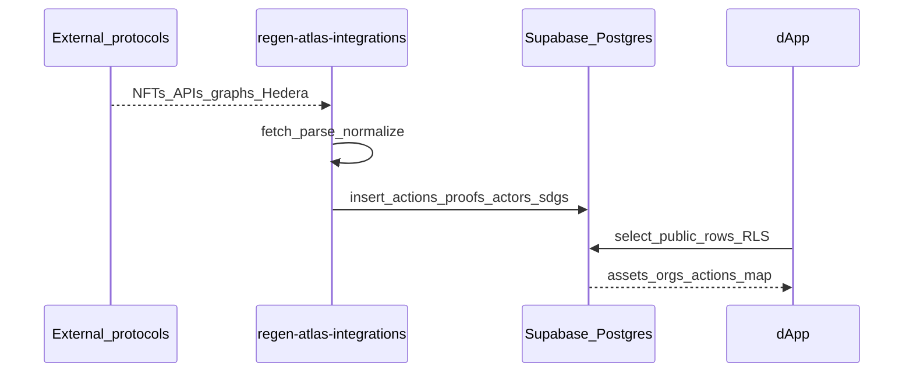
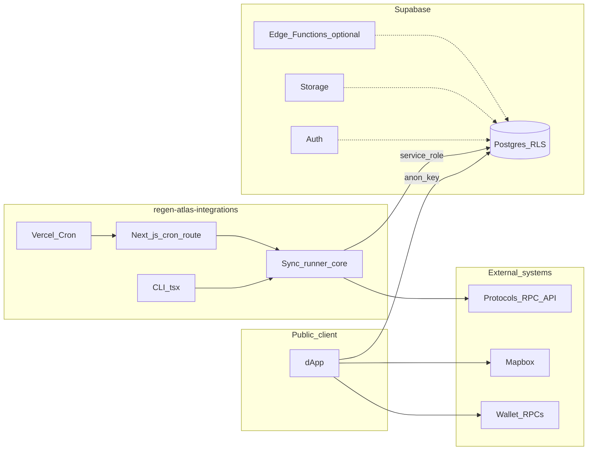

# Regen Atlas — infrastructure overview

This document describes how the public **dApp** ([Regen-Atlas/Regen-Atlas](https://github.com/Regen-Atlas/Regen-Atlas)), the integration service ([Regen-Atlas/regen-atlas-integrations](https://github.com/Regen-Atlas/regen-atlas-integrations)), and the shared **Supabase** backend fit together. A private **admin panel** (not open source) uses the same Supabase project for authenticated data management; this document does not describe that application. These are separate repositories; file paths below are relative to each repository’s root.

---

## System overview

Regen Atlas is a map-first discovery layer for regenerative and environmental assets. The **dApp** reads published data from Supabase using the **anon** key under **Row Level Security (RLS)**. **regen-atlas-integrations** runs on a schedule (Vercel Cron) and on demand (CLI) to pull data from external protocols—EVM chains, REST APIs, GraphQL, Hedera Mirror Node—and insert normalized **actions** and related rows using the **service role**, which bypasses RLS for trusted server-side ingestion. Staff curate and extend the catalog through separate authenticated clients (including the private admin panel) subject to RLS policies.

---

## End-to-end data flow



**Plain-language steps**

1. Connectors **fetch** protocol-specific payloads (e.g. NFT token URIs, Silvi project JSON, Hypercerts GraphQL, Hedera mirror transactions).
2. Each connector **parses** into a shared `ParsedActionData` shape (title, description, geography as PostGIS WKT, SDG ids, proof links, protocol/platform ids, etc.—see `src/core/types.ts` in the integrations repository).
3. **`insertAction`** writes a row in `actions` (initial **status** `DRAFT`), links SDGs and actors, and inserts `actions_proofs`. Duplicates are avoided by checking **`proof_metadata_link`** before insert (`src/core/database.ts` in the integrations repository).
4. The dApp queries the same tables through the anon client; **RLS** determines which rows are visible without authentication.

---

## Architecture (components)



Authenticated staff workflows (private admin panel and related tools) also use Supabase **Auth** and **Postgres** under RLS; they are not detailed here.

---

## dApp (public app)

| Topic | Detail |
|-------|--------|
| **Stack** | Vite, React 18, TypeScript, Tailwind/DaisyUI, React Router v6 |
| **State / data** | TanStack Query (`QueryClient` in `src/main.tsx`); Supabase reads via `src/shared/helpers/supabase.ts` and hooks such as `useSupabaseTable` |
| **Map** | `react-map-gl` + Mapbox GL (`VITE_MAPBOX_ACCESS_TOKEN`) |
| **Wallets** | wagmi v2, ConnectKit, viem; default Celo mainnet RPC can use Infura (`VITE_INFURA_API_KEY`), WalletConnect (`VITE_WC_PROJECT_ID`) |
| **Trading / DeFi** | Uniswap v3–style helpers under `src/modules/uniswap/` (quotes, pools, trades) for supported flows |
| **Other** | Optional GA4 (`VITE_GOOGLE_ANALYTICS_ID`), ecotoken-related URLs where configured |

**Routes** (from `src/main.tsx`)

| Path | Purpose |
|------|---------|
| `/` | Map explore (filters, asset listings) |
| `/assets/:assetId` | Asset detail |
| `/orgs`, `/orgs/:id` | Organizations list and detail |
| `/actions`, `/actions/:id` | Actions list and detail (includes data ingested by integrations) |
| `/add-asset` | Contribution / intake flow |
| `/privacy-policy`, `/imprint` | Legal |
| `/kitchensink` | Internal UI dev page |

The dApp is a static SPA; configure `VITE_*` at build time for each environment.

---

## regen-atlas-integrations

| Topic | Detail |
|-------|--------|
| **Stack** | Next.js (App Router), TypeScript; sync logic lives under `src/` and is invoked from `src/cli.ts` and `app/api/cron/sync/route.ts` |
| **Runner** | `runSync` in `src/core/runner.ts` loads the connector by id, calls `connector.fetch(scope)`, then `connector.parse` per record, then `insertAction` |
| **Connector contract** | `Connector`: `fetch(scope?)`, `parse(raw)` → `ParsedActionData` (`src/core/types.ts`) |
| **Idempotency** | Skips inserts when `actions_proofs` already has the same `proof_metadata_link` |
| **Cron HTTP** | `GET /api/cron/sync?connector=<id>` (`app/api/cron/sync/route.ts`): validates `User-Agent` prefix `vercel-cron/`; optional `Authorization: Bearer <CRON_SECRET>`; `maxDuration` 300s (adjust on Vercel plan) |
| **CLI** | `npx tsx src/cli.ts sync <connector> [options]` (see below) |

### Connectors (summary)

| Connector id | Typical sources | Notable env vars | In Vercel cron (see `vercel.json`) |
|----------------|-----------------|------------------|-------------------------------------|
| `atlantis` | Impact Certificate NFTs on Arbitrum, Base, Celo, Optimism | `ATLANTIS_PROTOCOL_ID`, `RPC_*_URL` | Yes (daily) |
| `silvi` | Silvi REST API | `SILVI_PROTOCOL_ID`, `SILVI_API_URL` | Yes (daily) |
| `ecocertain` | Hypercerts / GainForest-related GraphQL | `ECOCERTAIN_PROTOCOL_ID`, optional `ECOCERTAIN_*` overrides | Yes (scheduled) |
| `hedera` | Hedera Mirror Node, issuers (DOVU, Tolam, etc.) | `HEDERA_PROTOCOL_ID`, optional `HEDERA_*` | No — CLI / manual |
| `example-rest` | Template REST API | `EXAMPLE_REST_PROTOCOL_ID`, `EXAMPLE_REST_API_URL` | No |

**Atlantis chain scope:** CLI supports `--chain <name>` for one of **arbitrum**, **base**, **celo**, **optimism** (`src/connectors/atlantis/config.ts`). Omitting `--chain` runs all configured chains. RPC URLs default to public endpoints; set `RPC_ARBITRUM_URL`, `RPC_BASE_URL`, `RPC_CELO_URL`, `RPC_OPTIMISM_URL` for production throughput.

**Hedera scope:** CLI supports `--actor <label>` (repeat or comma-separated) to restrict issuers; only valid with `sync hedera`.

**Dry run:** `--dry-run` parses and logs intended inserts without writing (except safe read-only lookups as implemented).

**Sync statistics:** Each run returns `successCount`, `skipCount`, `errorCount` (per-record failures are logged; runner continues).

---

## Supabase (shared backend)

| Area | Role |
|------|------|
| **Postgres** | Canonical relational store: assets, types, issuers, tokens, chains, certifications, organizations, ecosystems, **actions**, and many mapping tables. RLS policies distinguish anonymous reads, authenticated users, and service tasks. |
| **Auth** | Email/password and other providers as configured; used by private staff tools and any logged-in flows. |
| **PostGIS** | Geographic fields (e.g. `geography` on actions) for map queries. |
| **Storage** | Public buckets for images/icons used by the product, for example: `assets-images`, `orgs-images`, `ecosystems-icons`, `actions-images`, `action-protocols-images` (uploaded via privileged clients; URLs stored in Postgres). |
| **Edge Functions** | Optional server-side functions (e.g. third-party market data) callable with a project URL + key; not required for the public map read path. |

**Integration write path (representative):** `actions` → `actions_sdgs_map`, `actions_actors` / `actions_actors_map`, `actions_proofs` (links `protocol_id`, `platform_id`, explorer and metadata URLs). Platform ids from chains may be normalized (e.g. Atlantis `PLATFORM_ID_MAP` in `src/connectors/atlantis/config.ts`) to match `platforms.id` in the database.

---

## Security model

| Actor | Credential | Exposure |
|-------|------------|----------|
| dApp visitors | **Anon** key | Browser; must rely on RLS for read (and any write) rules. |
| Staff (private tools) | Authenticated **user** session + anon key | Browser; RLS enforces role-based access. |
| regen-atlas-integrations | **Service role** key | **Server only** (Vercel env, local `.env`); never embed in client bundles. |
| Vercel Cron | Cron `User-Agent` + optional `CRON_SECRET` | Only your Vercel project should trigger `/api/cron/sync`. |

---

## Deployment and operations

| Piece | Typical hosting |
|-------|-----------------|
| **Regen-Atlas (dApp)** | Static hosting (Vercel, Netlify, S3+CDN, etc.): `npm run build`, deploy `dist/` with env vars set at build time. |
| **regen-atlas-integrations** | Vercel (or compatible Node host): `npm run build`, deploy Next.js; configure `vercel.json` cron + environment variables. |
| **Supabase** | Managed project; apply migrations and RLS policies in the Supabase project tied to production. |

**Local development**

**Regen-Atlas** (dApp)

```bash
npm install
npm run dev
```

**regen-atlas-integrations**

```bash
npm install
cp .env.example .env   # fill in secrets
npx tsx src/cli.ts sync atlantis --dry-run
npm run dev              # Next.js with API routes for manual cron testing
```

**Production sync examples**

```bash
npx tsx src/cli.ts sync atlantis --chain base
npx tsx src/cli.ts sync hedera --actor DOVU --dry-run
npm run sync:ecocertain
```

The `package.json` in regen-atlas-integrations also defines shortcuts such as `sync:atlantis`, `sync:silvi`, and per-actor `sync:hedera:*` scripts for common Hedera issuers.

Cron schedules are defined in `vercel.json` at the integrations repository root (see table below).

---

## Environment variables (consolidated)

### Regen-Atlas / dApp (`VITE_*`)

| Variable | Required | Purpose |
|----------|----------|---------|
| `VITE_SUPABASE_URL` | Yes | Supabase project URL |
| `VITE_SUPABASE_ANON_KEY` | Yes | Supabase anon (public) key |
| `VITE_MAPBOX_ACCESS_TOKEN` | Yes for map | Mapbox GL |
| `VITE_INFURA_API_KEY` | Recommended for Celo RPC in code | RPC URL in wagmi/viem config |
| `VITE_WC_PROJECT_ID` | If using WalletConnect | WalletConnect project id |
| `VITE_GOOGLE_ANALYTICS_ID` | No | Analytics |
| `VITE_ECOTOKEN_ENDPOINT` | No | Feature-specific API |
| `VITE_ECOTOKEN_CONFIRMATION` | No | Feature-specific confirmation URL |

### regen-atlas-integrations (server / CLI)

| Variable | Required | Purpose |
|----------|----------|---------|
| `SUPABASE_URL` | Yes | Same project as apps |
| `SUPABASE_SERVICE_ROLE_KEY` | Yes | Ingestion (secret) |
| `ATLANTIS_PROTOCOL_ID` | For `atlantis` | Protocol id (UUID) in the database |
| `SILVI_PROTOCOL_ID`, `SILVI_API_URL` | For `silvi` | Protocol id + API base URL |
| `ECOCERTAIN_PROTOCOL_ID` | For `ecocertain` | Protocol id |
| `HEDERA_PROTOCOL_ID` | For `hedera` | Protocol id |
| `EXAMPLE_REST_PROTOCOL_ID`, `EXAMPLE_REST_API_URL` | For `example-rest` | Template connector |
| `RPC_BASE_URL`, `RPC_ARBITRUM_URL`, `RPC_CELO_URL`, `RPC_OPTIMISM_URL` | No (recommended prod) | EVM JSON-RPC overrides |
| `RPC_THROTTLE_MS`, `RPC_MAX_RETRIES` | No | Rate-limit handling |
| `HEDERA_EXTRA_TREASURIES_JSON`, `HEDERA_DYNAMIC_GEO` | No | Hedera connector |
| `ECOCERTAIN_GRAPHQL_URL`, `ECOCERTAIN_HYPERBOARD_ID`, `ECOCERTAIN_HYPERCERT_IDS` | No | Ecocertain scope |
| `CRON_SECRET` | No | Extra auth for `/api/cron/sync` |

---

## Vercel cron schedule (current)

Defined in `vercel.json` at the integrations repository root:

| Schedule (UTC) | Path |
|----------------|------|
| `0 6 * * *` | `/api/cron/sync?connector=atlantis` |
| `5 6 * * *` | `/api/cron/sync?connector=silvi` |
| `10 6 * * *` | `/api/cron/sync?connector=ecocertain` |

**Note:** `hedera` and `example-rest` are not on this schedule; run them via CLI or add cron entries.

---

## Source layout (reference)

| Repository / area | Paths |
|-------------------|--------|
| Regen-Atlas (dApp) | `src/` — `main.tsx` (routes), `Explore/`, `AssetDetails/`, `Actions/`, `Orgs/`, `shared/`, `modules/uniswap/`, `wagmi.ts` |
| regen-atlas-integrations | `src/core/` (runner, database, types), `src/connectors/`, `app/api/cron/sync/`, `vercel.json` |
