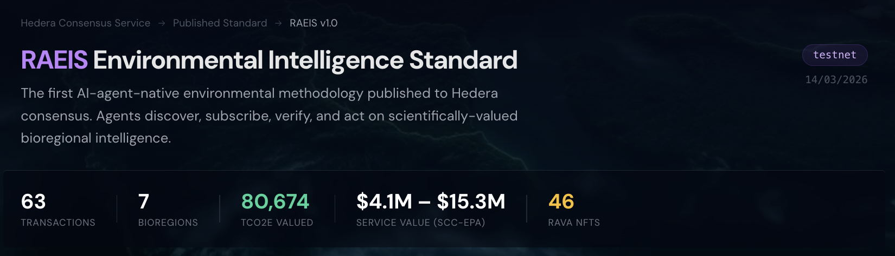

# Regen Atlas × Hedera: Environmental Intelligence for AI Agents

**Hedera Hello Future Hackathon — Sustainability Track**

**[Live Demo](https://hedera-hello-future.vercel.app)** · **[Methodology on HashScan](https://hashscan.io/testnet/topic/0.0.8217610)** · **[RAVA NFT Collection](https://hashscan.io/testnet/token/0.0.8217620)**

Regen Atlas aggregates environmental impact data from 6 Guardian-based platforms on Hedera and publishes the first AI-agent-native environmental intelligence methodology (RAEIS) back to Hedera using three native services.

## What It Does

1. **Reads** 46 environmental actions from Hedera Mirror Node — tokenized carbon credits across DOVU, Tolam Earth, Capturiant, OrbexCO2, Global Carbon Registry, and TYMLEZ
2. **Values** each action using EPA Social Cost of Carbon ($51–$190/tCO2e), with trust-weighted confidence based on certification tier (Verra VCS, Gold Standard, self-certified, bare HTS)
3. **Publishes** a three-layer intelligence standard back to Hedera:
   - **Layer 1 (HCS):** RAEIS methodology topic — the machine-readable standard
   - **Layer 2 (HCS):** Per-bioregion intelligence feeds with agent directives (VERIFY, BOUNTY, ALERT)
   - **Layer 3 (HTS):** RAVA NFT collection — one attestation NFT per verified action

## Hedera Services Used

| Service | Usage |
|---------|-------|
| **Mirror Node API** | Ingests HTS tokens from 9 treasury accounts across 6 Guardian platforms, extracts Guardian topic IDs from token memos for provenance tracing |
| **Hedera Consensus Service (HCS)** | Publishes methodology standard + 7 bioregion intelligence feeds + 2 agent report topics (structured JSON messages) |
| **Hedera Token Service (HTS)** | Mints RAVA NFT collection with 46 verification attestation NFTs |

4. **Agents** — two autonomous OpenClaw agents coordinate through HCS:
   - **Impact Scout:** reads bioregion feeds via Mirror Node, scores opportunities on 4 axes, posts OpportunityReport to HCS
   - **Due Diligence:** reads Scout's report from HCS, cross-verifies source tokens on mainnet, posts verdicts to a second HCS topic

**Total: 67 Hedera transactions** — all verifiable on HashScan.

## Architecture

```
Mirror Node (read)          HCS (write)              HTS (write)
┌─────────────────┐    ┌──────────────────┐    ┌──────────────────┐
│ 9 treasury accts │    │ RAEIS Methodology│    │ RAVA NFT         │
│ 6 Guardian plats │───>│ 7 Bioregion Feeds│    │ Collection       │
│ ~46 env actions  │    │ Agent Directives │    │ 46 attestations  │
└─────────────────┘    └──────────────────┘    └──────────────────┘
                               │
                               v
                    ┌──────────────────────┐
                    │   AGENT NETWORK      │
                    │                      │
                    │ Impact Scout ──HCS──>│
                    │   reads feeds        │ Due Diligence
                    │   ranks bioregions   │   reads Scout's HCS
                    │   posts report       │   verifies on mainnet
                    │                      │   posts verdicts
                    └──────────────────────┘
```

**Key design:** Agents coordinate exclusively through HCS. The Due Diligence agent discovers the Scout's report by reading an HCS topic via Mirror Node — not through a shared database or direct API call. Any third-party agent can join by reading these topics.

## Verify on HashScan

| Artifact | Topic/Token ID | HashScan Link |
|----------|---------------|---------------|
| RAEIS Methodology | `0.0.8217610` | [View Topic](https://hashscan.io/testnet/topic/0.0.8217610) |
| Bioregion: Western European Broadleaf Forests (PA12) | `0.0.8217612` | [View Topic](https://hashscan.io/testnet/topic/0.0.8217612) |
| Bioregion: Celtic Broadleaf Forests (PA1) | `0.0.8217614` | [View Topic](https://hashscan.io/testnet/topic/0.0.8217614) |
| Bioregion: Central US Mixed Grasslands (NA22) | `0.0.8217615` | [View Topic](https://hashscan.io/testnet/topic/0.0.8217615) |
| Bioregion: Southeast Asian Tropical Forests (OC1) | `0.0.8217616` | [View Topic](https://hashscan.io/testnet/topic/0.0.8217616) |
| Bioregion: Northern Andean Montane Forests (NT14) | `0.0.8217617` | [View Topic](https://hashscan.io/testnet/topic/0.0.8217617) |
| Bioregion: East African Montane Forests (AT7) | `0.0.8217618` | [View Topic](https://hashscan.io/testnet/topic/0.0.8217618) |
| Bioregion: Eastern Australian Temperate Forests (AA8) | `0.0.8217619` | [View Topic](https://hashscan.io/testnet/topic/0.0.8217619) |
| RAVA NFT Collection | `0.0.8217620` | [View Token](https://hashscan.io/testnet/token/0.0.8217620) |
| Agent: Impact Scout | `0.0.8218356` | [View Topic](https://hashscan.io/testnet/topic/0.0.8218356) |
| Agent: Due Diligence | `0.0.8218357` | [View Topic](https://hashscan.io/testnet/topic/0.0.8218357) |

## RAEIS: Three-Layer Standard

### Layer 1 — Methodology (HCS)

A machine-readable methodology published to Hedera consensus. Defines how bioregional service value is calculated, what certifications mean, how to interpret tCO2e across platforms, and what agents need to implement to be RAEIS-compliant.

```json
{
  "schema": "RAEIS/Methodology/v1",
  "methodology": {
    "valuation": "SCC-EPA-2024",
    "carbonPrice": { "low": 51, "high": 190, "unit": "USD/tCO2e" },
    "trustHierarchy": ["guardian+registry", "guardian+self", "bare-hts"]
  },
  "certifierRegistry": {
    "verra-vcs": { "tier": "guardian+registry", "weight": 1.0 },
    "gold-standard": { "tier": "guardian+registry", "weight": 1.0 },
    "dovu-dmrv": { "tier": "guardian+self", "weight": 0.7 },
    "bare-hts": { "tier": "bare-hts", "weight": 0.3 }
  },
  "agentInterface": {
    "capabilities": ["eii-interpret", "gap-analysis", "capital-routing"],
    "taskTypes": ["GROUND_TRUTH", "SPECIES_SURVEY", "WATER_SAMPLE"]
  }
}
```

### Layer 2 — Bioregional Intelligence Feeds (HCS)

One HCS topic per bioregion. Agents subscribe to these for real-time intelligence. Each message includes structured directives telling agents what to DO with the data.

```json
{
  "schema": "RAEIS/BioregionalIntelligence/v1",
  "bioregion": { "code": "PA12", "name": "Western European Broadleaf Forests" },
  "aggregate": {
    "platforms": 3, "actions": 7, "tCO2e": 15420.5,
    "serviceValue": { "low": 786445, "high": 2929895 }
  },
  "agentDirectives": [
    { "type": "VERIFY", "target": "tCO2e", "confidence": 0.7 },
    { "type": "BOUNTY", "taskType": "GROUND_TRUTH", "budget": 500 },
    { "type": "ALERT", "channel": "economic", "signal": "gap_factor_infinite" }
  ]
}
```

### Layer 3 — Verification NFTs (HTS)

One HTS NFT collection: RAVA (RAEIS Verified Action). Each serial = one independently verified environmental action. Onchain metadata (≤100 bytes) references full provenance.

```
RAEIS:v1:<actionId>:<bioregionCode>:<sourceToken>
```

## Agent Network (OpenClaw Bounty)

Two autonomous OpenClaw agents that consume RAEIS feeds and coordinate entirely through Hedera Consensus Service — no shared database, no direct API calls between agents.

**Impact Opportunity Scout** — reads all 7 bioregion HCS topics via testnet Mirror Node, scores each bioregion on four axes (certification strength 25%, carbon tonnage 25%, data coverage 15%, market gap 35%), and posts a ranked OpportunityReport back to HCS.

**Due Diligence Agent** — discovers the Scout's OpportunityReport by reading its HCS topic via Mirror Node (the same way any third-party agent would). Cross-verifies each referenced token against Hedera mainnet Mirror Node. Checks token existence, supply, memo content, and Guardian topic linkage. Posts a DueDiligenceReport with PASS/CAUTION/FAIL verdicts.

**Results:** 10 tokens passed verification, 5 flagged CAUTION (tokens exist on mainnet but lack Guardian topic IDs in their memos — a real finding, not synthetic data).

**Why this matters for OpenClaw:** RAEIS feeds are designed for machine consumption. Any agent can join the network by reading public HCS topics via Mirror Node. The Scout and Diligence agents demonstrate a closed-loop pipeline: ingest feeds, analyze, verify, and publish structured reports back to consensus — all composable by future agents.

```bash
cd integrations
npm run agent:run              # Create topics, run Scout, run Diligence
npm run agent:scout            # Run Scout only
npm run agent:diligence        # Run Diligence only
```

| File | Purpose |
|------|---------|
| `integrations/src/agents/scout-SOUL.md` | OpenClaw personality spec for Impact Scout |
| `integrations/src/agents/diligence-SOUL.md` | OpenClaw personality spec for Due Diligence |
| `integrations/src/agents/scout.ts` | Scout implementation (feed reading, scoring, HCS posting) |
| `integrations/src/agents/diligence.ts` | Diligence implementation (mainnet verification, verdicts) |
| `integrations/src/agents/mirror-reader.ts` | Mirror Node REST client with HCS chunk reassembly |

## Guardian Integration

The data pipeline reads from 6 Guardian-based platforms via Hedera Mirror Node:

| Platform | Treasury Account | Actions | Certifications |
|----------|-----------------|---------|----------------|
| DOVU | `0.0.612877` | 5 | DOVU dMRV Standard |
| Tolam Earth | `0.0.2091527` | 6 | Verra VCS, Forward Carbon |
| Capturiant | `0.0.4063795` | 4 | Capturiant Standard |
| OrbexCO2 | `0.0.4354857` | 22 | OrbexCO2 Standard |
| Global Carbon Registry | `0.0.3805025` | 4 | Gold Standard TPDDTEC |
| TYMLEZ | `0.0.3948498` | 1 | TYMLEZ MRV |
| **Total** | **9 accounts** | **46** | |

**Provenance tracing:** Guardian topic IDs are extracted from HTS token memos (DOVU format: `DOVU:SYMBOL:topic_id`; Tolam/GCR: direct topic in memo; Capturiant: IPFS CID in memo), linking each credit back to its Guardian MRV policy.

## Valuation Engine

- **EPA Social Cost of Carbon 2024:** $51–$190/tCO2e (central estimate $120)
- **Trust hierarchy:** Guardian+Registry (weight 1.0) > Guardian+Self (0.7) > Bare HTS (0.3)
- **Per-provenance confidence:** High (structured tCO2e + verified MRV), Medium (tCO2e only), Low (no structured data)
- **Bioregion mapping:** Actions mapped to One Earth bioregion codes via country inference

## Pages

| Route | Description |
|-------|-------------|
| `/publish` | **Start here** — RAEIS methodology, bioregion feeds, RAVA NFTs, transaction log with HashScan links |
| `/intelligence` | Intelligence dashboard — valuation analysis, asset vs action breakdown, gap charts |
| `/actions` | Environmental actions from Guardian platforms with protocol filters |
| `/` | Explore — Map of ecological assets with bioregion drill-down panels |

## Quick Start

```bash
npm install
npm run dev              # http://localhost:5173
```

### Publish to Hedera (testnet)

```bash
cd integrations
npm install
npm run publish:hedera            # Live publish to testnet
npm run publish:hedera:dry-run    # Preview without submitting
```

Requires `integrations/.env`:
```
HEDERA_OPERATOR_ID=0.0.XXXXX
HEDERA_OPERATOR_KEY=302e...
HEDERA_NETWORK=testnet
```

## Tech Stack

- **Frontend:** React + TypeScript + Vite + Tailwind CSS + Recharts + Mapbox GL
- **Hedera:** @hashgraph/sdk (HCS + HTS), Mirror Node REST API
- **Data:** Supabase (action metadata)

## What Existed Before

Regen Atlas is an open-source registry of 500+ tokenized ecological assets with a scientific valuation engine. See [regenatlas.xyz](https://regenatlas.xyz).

**New for Hedera Hello Future:**
- Hedera Guardian ingestion (Mirror Node → 46 actions from 6 platforms)
- RAEIS three-layer standard (HCS methodology + bioregion feeds + HTS NFTs)
- Agent network: 2 OpenClaw agents coordinating through HCS (Scout + Due Diligence)
- Intelligence panel with asset/action protocol analysis
- `/publish` page with interactive documentation for judges
- 67 real Hedera testnet transactions

## Team

**Pat Rawson** — [@papa-raw](https://github.com/papa-raw) · [ecofrontiers.xyz](https://ecofrontiers.xyz)

## License

MIT
